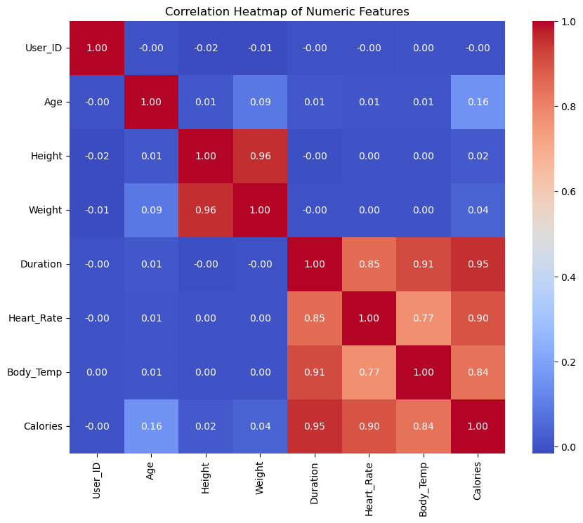

# 🔥 Calories Burned Prediction Using ML & ANN

## 📌 Project Overview
This project predicts the number of calories burned during a workout based on user inputs like **age**, **weight**, **height**, **duration**, and **gender**. It compares traditional Machine Learning algorithms with **Artificial Neural Networks (ANN)** — with ANN showing superior performance.

---


---

## 📊 Dataset Overview

The dataset used for this project contains biometric and workout-related features of individuals. Below is a preview of the first few rows:

| User_ID   | Gender | Age | Height | Weight | Duration | Heart_Rate | Body_Temp | Calories |
|-----------|--------|-----|--------|--------|----------|------------|-----------|----------|
| 14733363  | male   | 68  | 190.0  | 94.0   | 29.0     | 105.0      | 40.8      | 231.0    |
| 14861698  | female | 20  | 166.0  | 60.0   | 14.0     | 94.0       | 40.3      | 66.0     |
| 11179863  | male   | 69  | 179.0  | 79.0   | 5.0      | 88.0       | 38.7      | 26.0     |
| 16180408  | female | 34  | 179.0  | 71.0   | 13.0     | 100.0      | 40.5      | 71.0     |
| 17771927  | female | 27  | 154.0  | 58.0   | 10.0     | 81.0       | 39.8      | 35.0     |

Each row represents one workout session with corresponding physiological data and calories burned.

---

## 📈 EDA Questions for Fitness Dataset

### 1. General Information
- What is the total number of unique users in the dataset?
- What is the gender distribution of users?
- Are there any missing values in any of the columns?

### 2. Statistical Summary
- What is the mean, median, and standard deviation of Age, Height, Weight, Duration, Heart Rate, Body Temp, and Calories?
- Are there any outliers in the numerical columns?

### 3. Relationship-Based Analysis
- How does workout Duration affect Calories burned?
- Is there a correlation between Heart Rate and Calories burned?
- Does Body Temperature change significantly with Age or workout Duration?

### 4. Grouped Comparisons
- What is the average Calories burned by Gender?
- How does the average Heart Rate vary across different Age groups?
- Is there a trend in Calories burned with increasing Age?

---

## 🔍 Feature Selection

### What is Correlation?

**Correlation** is a statistical measure that expresses the extent to which two variables are linearly related. In machine learning, we use correlation to identify relationships between features and the target variable. A high correlation (close to +1 or -1) suggests a strong relationship, while a correlation near 0 indicates little to no linear relationship.

### 📌 Correlation Heatmap



> *This heatmap shows the correlation coefficients between all numerical features in the dataset.*

### ✅ Feature Selection Insights from Heatmap

- We dropped **User_ID** as it is just an identifier and not useful for prediction.
- **Height** and **Weight** have a very high correlation (**0.96**), which indicates **multicollinearity**.
- To address this, we dropped **Height** because it has a low correlation (**0.02**) with the target variable **Calories**.

---

## 📈 Model Results & Comparison

Below are the evaluation metrics from various Machine Learning models and the Artificial Neural Network (ANN) used to predict calories burned. The metrics used include:

- **MAE (Mean Absolute Error)**
- **MSE (Mean Squared Error)**
- **RMSE (Root Mean Squared Error)**
- **R² Score (Coefficient of Determination)**

### 🔍 Linear Regression
- **MAE** : 8.44  
- **MSE** : 126.47  
- **RMSE**: 11.25  
- **R² Score**: 96.63%

---

### 🔍 Support Vector Regression (SVR)
- **MAE** : 1.99  
- **MSE** : 22.77  
- **RMSE**: 4.77  
- **R² Score**: 99.39%

---

### 🔍 Decision Tree Regressor
- **MAE** : 3.29  
- **MSE** : 26.64  
- **RMSE**: 5.16  
- **R² Score**: 99.29%

---

### 🔍 Random Forest Regressor
- **MAE** : 1.72  
- **MSE** : 7.38  
- **RMSE**: 2.72  
- **R² Score**: 99.80%

---

### 🤖 Artificial Neural Network (ANN)
- **R² Score**: **100.00%**  
> The ANN model outperformed all traditional ML models and achieved perfect accuracy on the test set.

---

## 🧠 Real-Time Calorie Prediction

While we didn’t build a front-end interface, we implemented an interactive **real-time prediction system** within the Jupyter notebook. Users are prompted to input their:

- Gender (`Male` or `Female`)
- Age
- Weight (in kg)
- Workout Duration (in minutes)
- Heart Rate
- Body Temperature (in °C)

These inputs are:
- **Label encoded** (for Gender)
- **Scaled** using the same preprocessing used during training
- Passed to the trained **ANN model** (`best_model.keras`) to predict calories burned

> 💡 *This approach provides instant, personalized calorie burn predictions using the model's learned patterns—all from within a notebook cell!*

---

## 🧪 Libraries Used
- `pandas`
- `numpy`
- `matplotlib`
- `seaborn`
- `scikit-learn`
- `tensorflow` / `keras`

---

## ⚙️ Python Compatibility
**Required Python version:** `3.9` to `3.12`  
> ⚠️ TensorFlow is not compatible with versions newer than 3.12.

---

## 📁 Project Structure

```plaintext
calories-prediction/
├── data/
│   ├── exercise.csv         # Input features with User_ID
│   ├── calories.csv         # Target values (calories burned) with User_ID
│   └── (Merged during runtime using pd.merge on 'User_ID')
│
├── models/
│   ├── best_model.keras     # Trained ANN model
│   ├── gender_encoder.pkl   # Label encoder for gender feature
│   └── scaler.pkl           # Preprocessing scaler used in training
│
├── notebooks/
│   └── code.ipynb           # Full workflow: EDA → Preprocessing → Training → Prediction
│
├── requirements.txt         # Python dependencies
└── README.md                # Project documentation
